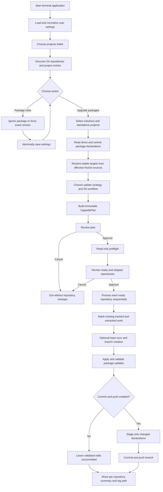
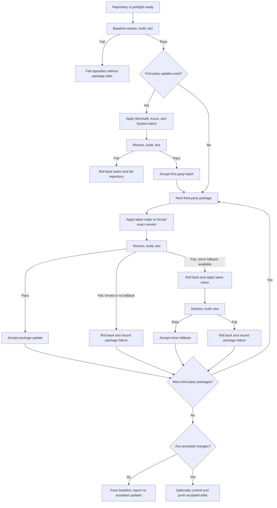

# Architecture and Design

## Architectural style

The application is organized as a small layered workflow. The presentation layer coordinates explicit domain services; the domain model carries immutable records between discovery, inventory, planning, preflight, and execution. External operations are isolated behind narrow abstractions such as `IProcessRunner`, `IConfigurationStore`, and `IAllPackageVersionsSource` so that core workflows can be tested without touching real repositories or networks.

There is no dependency-injection container. `ConsoleApplication.CreateDefault()` is the composition root and constructs the production object graph directly.

## Component map

| Layer | Component | Responsibility |
|---|---|---|
| Presentation | `ConsoleApplication` | Composes services, runs the terminal workflow, handles cancellation and exit codes. |
| Presentation | `TuiContents` and view models | Render selection, package rules, decisions, progress, and dialogs. |
| Presentation | `PresentationText` | Produces plan, preflight, progress, and summary text. |
| Configuration | `JsonConfigurationStore` | Loads and normalizes per-user JSON settings and saves them through a temporary-file replacement. |
| Discovery | `DiscoveryService` | Finds Git repositories, solutions, solution members, and standalone projects. |
| Packages | `PackageInventoryService` | Reads supported direct and centrally managed package declarations. |
| Packages | `NuGetVersionService` | Resolves stable automatic targets concurrently and retrieves all exact versions. |
| Planning | `UpgradePlanner` | Converts user decisions into immutable, repository-scoped edits and validation targets. |
| Execution | `PreflightService` | Revalidates files, tools, refs, remotes, branch names, and reviewed XML values. |
| Execution | `RunCoordinator` | Executes repositories sequentially through Git, edits, validation, commit, and push. |
| Execution | `PackageEditor` | Validates literal XML version values and applies edits through temporary-file replacements. |
| Execution | `GitService` | Wraps the Git commands used by preflight and execution. |
| Execution | `ProcessRunner` | Executes argument-safe child processes, captures output, and observes command-level cancellation boundaries. |
| Domain | records and enums in `Models.cs` | Define discovery results, decisions, plans, progress events, and run results. |

## End-to-end workflow



## Validated incremental execution



## Domain data flow

The main immutable types form a pipeline:

```text
DiscoveryResult
  └─ SelectionEntry[]
       └─ PackageOccurrence[]
            └─ PackageGroup[]
                 + PackageDecision[]
                 + GitWorkflowOptions
                      └─ UpgradePlan
                           ├─ RepositoryPreflight[]
                           └─ RepositoryRunResult[]
```

- `SelectionEntry` connects a selectable solution or project to its repository and member project paths.
- `PackageOccurrence` connects a package ID and current version to the exact XML declaration that owns it.
- `PackageGroup` groups occurrences across selections and carries resolved minor and major targets.
- `DeclarationEdit` records the reviewed old value, target value, XML location, and repository.
- `RepositoryPlan` contains unique edits plus solution or project paths used for validation.
- `UpgradePlan` freezes the Git choices, update strategy, repository plans, and creation time.
- `RepositoryRunResult` records status, branch, stash, commit, remote branch, changed packages, package-level outcomes, and log path.

## Important design decisions

### Plan before mutation

Planning is separate from execution. The user reviews a stable `UpgradePlan`, and `PackageEditor.Validate` confirms immediately before mutation that every declaration still has the reviewed old value. This prevents silently applying a stale decision after a project file changes.

### Conservative XML editing

Package declaration parsing uses local XML names so it works with typical MSBuild XML forms. Only one unambiguous, literal version location is accepted. Edits are grouped by file, written to temporary files, and then moved over their destinations. Existing UTF-8 BOM state and final newline style are retained.

### Shared central declaration deduplication

Multiple projects may resolve to the same `PackageVersion` entry. The planner groups edits by normalized declaration path and locator. One edit is emitted when targets agree; conflicting targets raise an error instead of choosing one silently.

### Two version-resolution paths

Automatic target resolution invokes:

```text
dotnet package list --project <project> --outdated --format json --no-restore
```

It adds `--highest-minor` for minor lookups and filters automatic targets to stable semantic versions. Work is parallelized with `Parallel.ForEachAsync`; the default concurrency is the logical processor count clamped to 2–8 workers.

The exact-version picker instead uses NuGet.Protocol to enumerate every version from enabled sources in the project's effective NuGet configuration. It includes prereleases and allows an intentional downgrade.

### Sequential repository execution

Version lookup is parallel, but repository mutation is sequential. This limits concurrent Git/file changes and produces deterministic repository-level results.

### Cancellation at safe boundaries

`Ctrl+C` requests cancellation. Once a child command starts, `ProcessRunner` waits for it to exit before observing cancellation. This avoids abandoning a Git or file-related command in an unknown partial state; cancellation may therefore appear delayed during a long restore, build, test, fetch, or push.

### Retained operational evidence

All child commands and their output go to one run log. The logger masks credentials embedded in HTTP URLs and values for `password`, `token`, `apikey`, or `api_key` query parameters. On Unix-like systems, newly created logs are given user read/write permissions only.

## Git command sequence

Depending on the selected workflow, execution may issue:

```text
git status --porcelain=v1 --untracked-files=all
git stash push --include-untracked --message <generated-message>
git switch <base>
git fetch <remote>
git pull --ff-only <remote> <base>
git switch --create <target>
dotnet restore <target>
dotnet build <target> --no-restore
dotnet test <target> --no-build --no-restore
git add -- <changed-package-files-only>
git commit --message "<branch> .NET nuget package update"
git push --set-upstream <remote> <branch>
```

Commands that do not apply to the chosen branch and delivery options are omitted.
